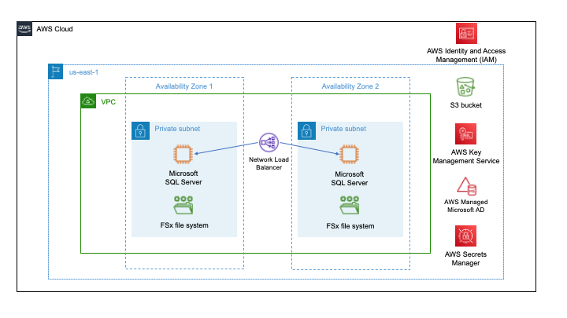

## Deploy Microsoft SQL Server Failover Cluster Instances on EC2 and FSx using Terraform

When Microsoft SQL Server databases are migrated to AWS, the first choice is Amazon Relational Database Service (Amazon RDS) for SQL Server. However, there are cases where Amazon RDS is not suitable and SQL Server needs to be deployed on Amazon Elastic Compute Cloud (EC2) in a highly available architecture. In this solution, SQL Server Failover Cluster Instances (FCI) are installed across Windows Server Failover Clustering (WSFC) nodes.

The included terraform module provisions up to two Amazon EC2 SQL Server instances with an Amazon FSx for Windows File Server file system acting as the quorum witness and storing shared data and log files. Regardless of the number of instances configured (typically one for development and two for production environments) the SQL Server instance nodes will always create and join an FCI cluster to ensure environmental parity. For configurations which use two nodes for high availability, an internal network load balancer will be provisioned, which uses a health probe configured on the FCI cluster to identify which node is the primary.

The code in this repository helps you set up the following target architecture

For prerequisites and instructions for using this AWS Prescriptive Guidance pattern, see [Deploy Microsoft SQL Server Failover Cluster Instances on EC2 and FSx using Terraform](https://apg-library.amazonaws.com/content-history-viewer/45f3ab19-d240-4353-ab6e-f6e565f537a4/1).

## Security

See [CONTRIBUTING](CONTRIBUTING.md#security-issue-notifications) for more information.

## License

This library is licensed under the MIT-0 License. See the LICENSE file.

